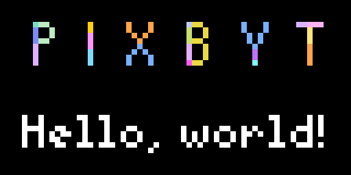

<p align="center">


</p>

<span align="center">

# You've never seen Tidbyt apps like this

**Pixbyt is a self-hosted [Tidbyt](https://tidbyt.com) app server for advanced apps**<br>
that aren't supported by the official [community app](https://tidbyt.dev/docs/publish/community-apps) server<br>
that you can access through Tidbyt's mobile app.

</span>

---

Your Tidbyt does not run apps directly; it depends on a server to periodically run apps and push the resulting images to the device.
When you install a [community app](https://tidbyt.dev/docs/publish/community-apps) through Tidbyt's mobile app, the app runs on Tidbyt's official app server.
For security reasons, there are a ton of limitations on what these apps are allowed to do, which means some awesome app ideas are impossible to implement.

Apps running on Pixbyt have none of these limitations:
- [x] Run **Python scripts and packages**, not just Starlark applets
- [x] Reach **local network resources**, not just the public internet
- [x] Work with **complex APIs**, not just simple REST HTTP requests
- [x] Read **local files**, like images or JSON
- [x] Organize your source code across **multiple files**

Pixbyt lets you realize your wildest Tidbyt dreams by making it easy to:
- **build** advanced Tidbyt apps,
- **install** advanced apps built by the community,
- **manage** app configurations and schedules,
- **package** apps together in a [Docker](https://www.docker.com/) image, and
- **launch** the app server using [Docker Compose](https://docs.docker.com/compose/).

## Examples

<table>
  <tr>
    <td valign="top" align="center">
      <br>
      <a href="./apps/hello-world/">hello-world</a>
    </td>
    <td valign="top" align="center">
      <br>
      <a href="https://github.com/DouweM/tidbyt-common-misconceptions">common-misconceptions</a>
    </td>
    <td valign="top" align="center">
      <br>
      <a href="https://github.com/DouweM/tidbyt-parcelapp">parcelapp</a>
    </td>
    <td valign="top" align="center">
      <br>
      <a href="https://github.com/DouweM/tidbyt-ffmpeg">ffmpeg</a>
    </td>
  </tr>
  <tr>
    <td valign="top" align="center">
      <br>
      <a href="https://github.com/DouweM/tidbyt-guess-the-flag">guess-the-flag</a>
    </td>
    <td valign="top" align="center">
      <br>
      <a href="https://github.com/DouweM/tidbyt-owen-wilson-facts">owen-wilson-facts</a>
    </td>
    <td valign="top" align="center">
      <br>
      <a href="https://github.com/DouweM/tidbyt-speedtest">speedtest</a>
    </td>
    <td valign="top" align="center">
      <br>
      <a href="https://github.com/DouweM/tidbyt-revolution">revolution</a>
    </td>
  </tr>
</table>

## Architecture

Pixbyt's advanced features are enabled by [`tap-pixlet`](https://github.com/DouweM/tap-pixlet), an unofficial Tidbyt app runner that extends [Pixlet](https://github.com/tidbyt/pixlet) (the official Tidbyt app development framework) with an unofficial standard library named [Pixlib](https://github.com/DouweM/tap-pixlet/tree/main/tap_pixlet/pixlib), similar to how [Starlib](https://github.com/qri-io/starlib) is the unofficial standard library for [Starlark](https://github.com/google/starlark-go) (the Python-like language Tidbyt apps are written in).
Pixlib comes with functions like
[`file.read`](https://github.com/DouweM/tap-pixlet/blob/main/tap_pixlet/pixlib/file.star),
[`file.exec`](https://github.com/DouweM/tap-pixlet/blob/main/tap_pixlet/pixlib/file.star),
[`font.height`](https://github.com/DouweM/tap-pixlet/blob/main/tap_pixlet/pixlib/font.star), and
[`html.unescape`](https://github.com/DouweM/tap-pixlet/blob/main/tap_pixlet/pixlib/html.star),
helpful constants like
[`const.WIDTH`](https://github.com/DouweM/tap-pixlet/blob/main/tap_pixlet/pixlib/const.star),
[`const.HEIGHT`](https://github.com/DouweM/tap-pixlet/blob/main/tap_pixlet/pixlib/const.star), and
[`const.FPS`](https://github.com/DouweM/tap-pixlet/blob/main/tap_pixlet/pixlib/const.star), and
overloads `load` to support local files.

Pixbyt uses
`tap-pixlet` to run apps,
[`target-tidbyt`](https://github.com/DouweM/target-tidbyt) and [`target-webp`](https://github.com/DouweM/target-tidbyt) to push the resulting images to your Tidbyt or WebP image files,
[Airflow](https://airflow.apache.org/) to run apps on a schedule, and
[Meltano](https://github.com/meltano/meltano) to tie these components together.
Pixbyt also includes resources to [package your apps into a Docker image](./Dockerfile) (locally or [automatically on GitHub Actions](./.github/workflows/main.yml)) and [launch it using Docker Compose](./docker-compose.yml).

## Usage

This repo defines a Pixbyt app server with a single [`hello-world` app](./apps/hello-world) that shows off some of its advanced features.
It automatically builds a [`ghcr.io/douwem/pixbyt:main` Docker image](https://github.com/DouweM/pixbyt/pkgs/container/pixbyt) that can be [launched using Docker Compose](./docker-compose.yml) to render the app to a Tidbyt device every hour.

You will use this repo as a template to build your own Pixbyt app server with the apps of your choice:

### 1. Create your own Pixbyt repo

1. Click the green "Use this template" button at the top of this page, choose "Create a new repository", and create a new (private) repo.

1. Clone your new repository and enter the new directory:

    ```bash
    git clone git@github.com:<user>/pixbyt.git
    cd pixbyt
    ```

### 2. Configure your Tidbyt (and the `hello-world` app)

1. Create your own `.env` configuration file from the sample:

   ```bash
   cp .env.sample .env
   ```

1. Update `.env` with your configuration:
    - `TZ`: Find your ["TZ" timezone identifier](https://en.wikipedia.org/wiki/List_of_tz_database_time_zones). This is used by many apps that show the (relative) date and time.
    - `TIDBYT_DEVICE_ID`: Find your Device ID in the Tidbyt mobile app under Settings > General > Get API Key.
    - `TIDBYT_TOKEN`: Find your API Token the Tidbyt mobile app under Settings > General > Get API Key.
    - `HELLO_WORLD_NAME`: This is used by the `hello-world` example app. Optionally, replace `world` with your own name.

### 3. Add your apps

The most important files in your Pixbyt repo (and likely the only ones you'll want to edit) are the following, which define the apps, their configuration, and their schedules:

```bash
pixbyt
├─ apps.yml                 # Schedules
├─ .env                     # Configuration
└─ apps
   └─ <app>                 # One directory for each app
      ├─ <app>.star         # Main Starlark applet
      ├─ pixbyt.yml         # Pixbyt metadata
      ├─ requirements.txt   # Optional: Python packages (one `pip install` argument per line)
      ├─ apt-packages.txt   # Optional: APT packages (one `apt-get install` argument per line)
      ├─ *.py               # Optional: Python scripts to run using `file.exec`
      ├─ *.star             # Optional: Starlark files to load using `load`
      └─ *                  # Optional: Files to read using `file.read`
```

Out of the box, Pixbyt comes with a single [`hello-world` app](./apps/hello-world) that shows off some of its advanced features and can be used as an example to build your own.

**If you're just trying out Pixbyt** and don't yet have another app in mind yet that you'd like to run, you can keep `hello-world` and skip ahead to step 4 to build and launch the app server.

**If you don't want `hello-world`** on your Tidbyt, you can disable it by removing its entry from `apps.yml` (and `.env`), but **DO NOT remove the `apps/hello-world` directory** as the [GitHub Actions workflow](./.github/workflows/main.yml) that builds the Docker image uses it to test if the image works.

#### 3.1. Add an app

<details>
<summary>

##### Option A: Use the example `hello-world` app

</summary>

Skip ahead to step 4 to build and launch the app server.

</details>

<details>
<summary>

##### Option B: Install an existing app

</summary>

1. Add the app's repo as a submodule under `apps`, and enter the new directory:

    ```bash
    cd apps
    git submodule add https://github.com/<user>/<repo>.git <app>
    ```

    For example, to install [`common-misconceptions`](https://github.com/DouweM/tidbyt-common-misconceptions):

    ```bash
    cd apps
    git submodule https://github.com/DouweM/tidbyt-common-misconceptions.git common-misconceptions
    ```

    Note that in this case, the repo is called `tidbyt-common-misconceptions`, but the app directory needs to be called `common-misconceptions`.

2. Skip ahead to step 3.2 to configure the app.

</details>

<details>
<summary>

##### Option C: Create a brand-new app

</summary>

1. Create a new directory for your app under `apps`, and enter the new directory:

    ```bash
    cd apps
    mkdir <app>
    cd <app>
    ```

1. Create the main applet at `apps/<app>/<app>.star`.

    Any standard [Pixlet](https://github.com/tidbyt/pixlet) applet is supported, as well as all [Pixlib](https://github.com/DouweM/tap-pixlet/tree/main/tap_pixlet/pixlib) features.

    Note that the app directory and file names need to match.

    Optionally, your app directory can also contain:
    - `*.py` scripts to run using `file.exec`
    - `*.star` files to load using `load`
    - arbitrary files to read using `file.read`
    - Python packages in `requirements.txt` (one `pip install` argument per line)
    - APT packages in `apt-packages.txt`(one `apt-get install` argument per line)

1. Create the Pixbyt metadata file at `apps/<app>/pixbyt.yml`:

    ```yaml
    jobs:
    - name: <app>
      tasks:
      - tap-pixlet--<app> target-tidbyt
    - name: <app>--webp
      tasks:
      - tap-pixlet--<app> target-webp

    plugins:
      extractors:
      - name: tap-pixlet--<app>
        inherit_from: tap-pixlet
        # TODO: If your app does not have a `requirements.txt` defining Python packages, delete the following line:
        pip_url: git+https://github.com/DouweM/tap-pixlet.git -r apps/<app>/requirements.txt
        config:
          path: apps/<app>
          # TODO: If your app does not require configuration, delete the following lines:
          app_config:
            # TODO: For any key your app reads from `config`, add an entry mapping the lowercase key to an uppercase environment variable, e.g. `name: $HELLO_WORLD_NAME`:
            <key>: $<APP>_<KEY>
      ```

      1. Replace `<app>` with the name of your app
      1. Follow the `TODO` instructions.

</details>

#### 3.2. Configure the app

1. Add the app's update schedule to `apps.yml` under `schedules:`:

    ```yaml
    schedules:
    # ...
    - name: <app>
      interval: '<cron schedule expression>'
      job: <app>
    ```

    1. Replace `<app>` with the name of the app.
    1. Replace `<cron schedule expression>` with an appropriate [cron schedule expression](https://crontab.guru/):

         - Clocks should use `* * * * *` to update every minute, so that the displayed time is always as fresh as possible.
         - Apps that display a random entry from a list can use `*/5 * * * *` to update every 5 minutes, so that a fresh entry is shown on every app rotation.
         - Apps that show the latest data from some API can use `*/15 * * * *` to update every 15 minutes, or something else appropriate for your data source and the expected data freshness.
         - Apps that will always generate the same image can use `0 0 * * *` to update every day at midnight, just to be sure.

         (A recommended schedule is typically documented in the app's `README`.)

    For example:

    ```yaml
    schedules:
    - name: hello-world
      interval: '0 * * * *' # On the hour
      job: hello-world
    ```

1. If the app requires configuration, update `.env`:

    For any config key the app defines under `app_config:` in its `pixbyt.yml` file, add a value for the uppercase environment variable:

    ```bash
    <APP>_<KEY>="<value>"
    ```

    (The exact keys are typically documented in the app's `README`.)

    For example:

    ```bash
    HELLO_WORLD_NAME="world"
    ```

### 4. Build the app server

Note that you'll need to do this each time your apps, their schedules, or their configurations change.

<details>
<summary>

#### Option A: Build locally

</summary>

1. Ensure [Docker](https://www.docker.com/) is installed.
1. Build a Docker image containing Pixbyt and your apps:

    ```bash
    docker compose build
    ```

</details>

<details>
<summary>

#### Option B: Build using GitHub Actions

</summary>

1. Edit `docker-compose.yml`:
   1. Under `x-remote-image:`, replace `<username>` with your GitHub username
   2. Under `pixbyt:`, comment out `<<: *local-image` and uncomment `<<: *remote-image` on the next line

1. Commit your changes:

    ```bash
    git add -A
    git commit -m "Set up my Pixbyt"
    ```

1. Push your repo up to GitHub:

    ```bash
    git push origin main
    ```

    This will automatically trigger a GitHub Actions workflow to build a Docker image containing Pixbyt and your apps.

</details>

### 5. Launch the app server

1. Ensure [Docker](https://www.docker.com/) is installed.
1. If you chose to build your Docker image using GitHub Actions in the previous step, [authenticate with the GitHub Container Registry](https://docs.github.com/en/packages/working-with-a-github-packages-registry/working-with-the-container-registry#authenticating-with-a-personal-access-token-classic).
1. Launch Pixbyt using Docker Compose:

    ```bash
    docker compose up --pull --build -d
    ```

Your Pixbyt app server is now running, and your apps will update on schedule! You can find logs for your apps under `logs/<app>/`.

## Development

During app development or debugging, you will not want to build the entire Docker image each time your apps, their schedules, or their configurations change, nor will you want to run the entire app server.

Instead, you can directly render a specific app to a WebP image file or your Tidbyt, and quickly iterate on your app based on what you see in the logs and the output image.

### Set up development environment

1. Install [Pixlet](https://github.com/tidbyt/pixlet):

    - On macOS:

      ```bash
      brew install tidbyt/tidbyt/pixlet
      ```

    - [Other operating systems](https://tidbyt.dev/docs/build/installing-pixlet)

1. Install [Meltano](https://github.com/meltano/meltano):

   - With `pip`:

      ```bash
      pip install meltano
      ```

   - [Other installation methods](https://docs.meltano.com/getting-started/installation)

1. Manually install any APT packages defined in your apps' `apt-packages.txt` files.

1. Install [`tap-pixlet`](https://github.com/DouweM/tap-pixlet), [`target-tidbyt`](https://github.com/DouweM/target-tidbyt), and [`target-webp`](https://github.com/DouweM/target-tidbyt) using Meltano:

    ```bash
    meltano install
    ```

    Note that if an app defines Python packages in its `requirements.txt`, you'll need to manually do a clean install of the app's Meltano plugin every time that file changes:

    ```bash
    meltano install --clean extractor tap-pixlet--<app>
    ```

    For example:

    ```bash
    meltano install --clean extractor tap-pixlet--hello-world
    ```

### Render app to a WebP image file

The image will be created at `output/<app>/<timestamp>.webp`.
The exact path is also printed in the command output.

#### Regular size (64x32)

```bash
# Using local app definition:
meltano run <app>--webp
# Using app definition in Docker image:
docker compose run pixbyt run <app>--webp
```

For example:

```bash
# Using local app definition:
meltano run hello-world--webp
# Using app definition in Docker image:
docker compose run pixbyt run hello-world--webp
```

#### Magnified 8 times (512x256)

```bash
# Using local app definition:
TAP_PIXLET_MAGNIFICATION=8 meltano run <app>--webp
# Using app definition in Docker image:
docker compose run -e TAP_PIXLET_MAGNIFICATION=8 pixbyt run <app>--webp
```

For example:

```bash
# Using local app definition:
TAP_PIXLET_MAGNIFICATION=8 meltano run hello-world--webp
# Using app definition in Docker image:
docker compose run -e TAP_PIXLET_MAGNIFICATION=8 pixbyt run hello-world--webp
```

### Render app to your Tidbyt

#### Send to foreground

The app will immediately show up on your Tidbyt.
This is useful during development.

```bash
# Using local app definition:
TAP_PIXLET_BACKGROUND=false meltano run <app>
# Using app definition in Docker image:
docker compose run -e TAP_PIXLET_BACKGROUND=false pixbyt run <app>
```

For example:

```bash
# Using local app definition:
TAP_PIXLET_BACKGROUND=false meltano run hello-world
# Using app definition in Docker image:
docker compose run -e TAP_PIXLET_BACKGROUND=false pixbyt run hello-world
```

#### Send to background

The app will be added to the Tidbyt app rotation.
This is useful when you're running this command on a schedule, to make sure that the app will be up to date the next time it comes up in the app rotation.

```bash
# Using local app definition:
meltano run <app>
# Using app definition in Docker image:
docker compose run pixbyt run <app>
```

For example:

```bash
# Using local app definition:
meltano run hello-world
# Using app definition in Docker image:
docker compose run pixbyt run hello-world
```
