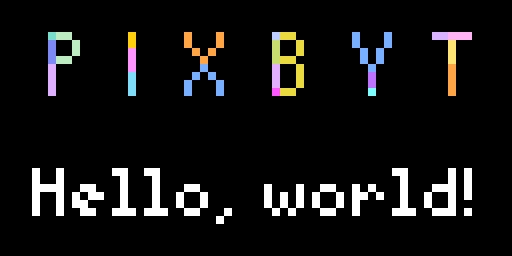

# Pixbyt Hello World

Example [Tidbyt](https://tidbyt.com/) app that shows off some of [Pixbyt](https://pixbyt.dev)'s advanced features:

- [x] [Run](https://github.com/DouweM/pixbyt/blob/main/apps/hello-world/client.star#L7) a [**Python script**](./hello.py)
- [x] [Read](https://github.com/DouweM/pixbyt/blob/main/apps/hello-world/client.star#L4) a [**local image file**](./logo.png)
- [x] [Load](https://github.com/DouweM/pixbyt/blob/main/apps/hello-world/hello-world.star#L3) a [**local Starlark module**](./client.star)



## Installation

1. [Create your own Pixbyt repo](https://github.com/DouweM/pixbyt#1-create-your-own-pixbyt-repo)
2. [Configure your Tidbyt](https://github.com/DouweM/pixbyt#2-configure-your-tidbyt)

## Configuration

Update `.env` with your configuration:

```bash
HELLO_WORLD_NAME="<your name>"
```

## Usage

Build and launch your Pixbyt app server:

1. [Build the app server](https://github.com/DouweM/pixbyt#4-build-the-app-server)
1. [Launch the app server](https://github.com/DouweM/pixbyt#5-launch-the-app-server)
